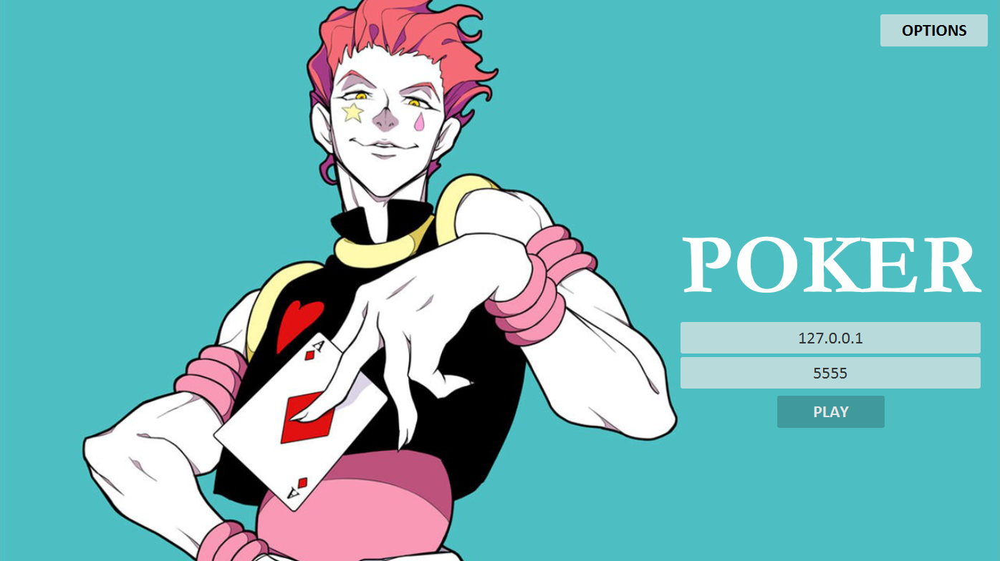
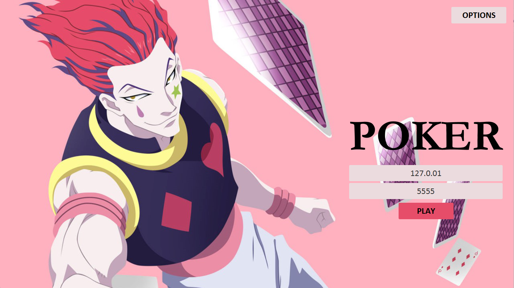
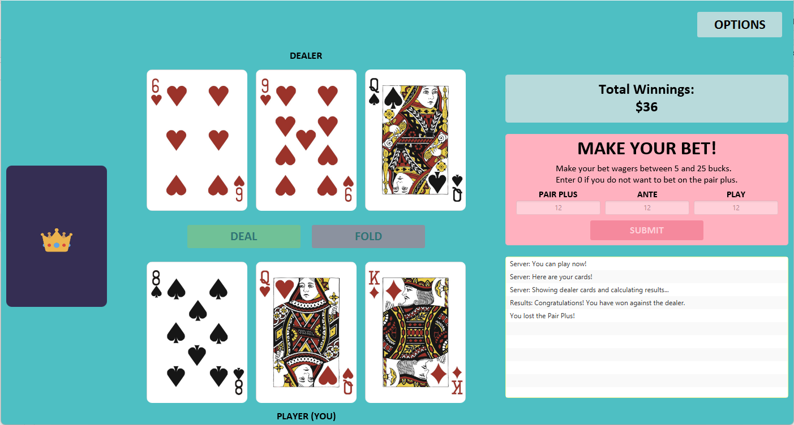
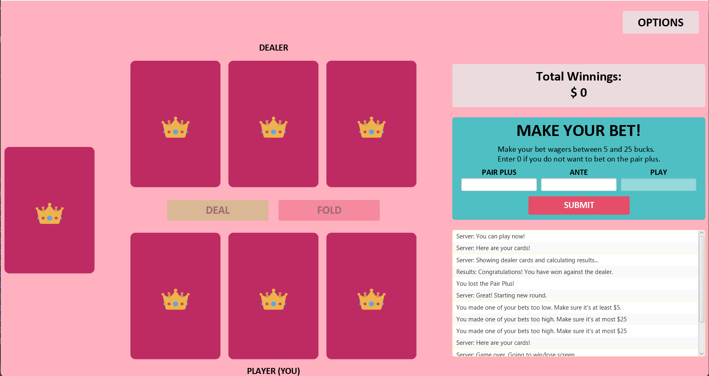
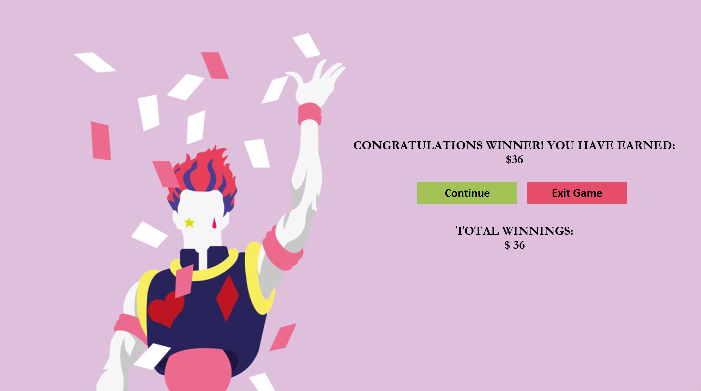
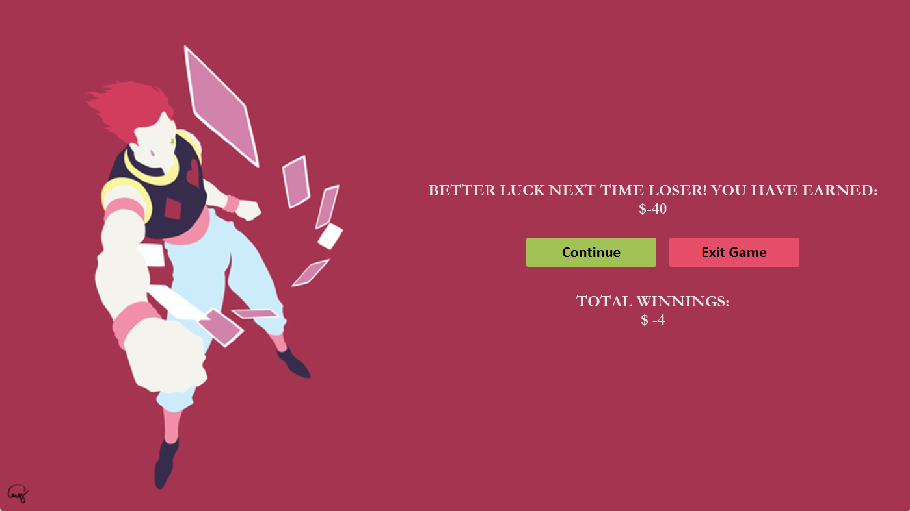
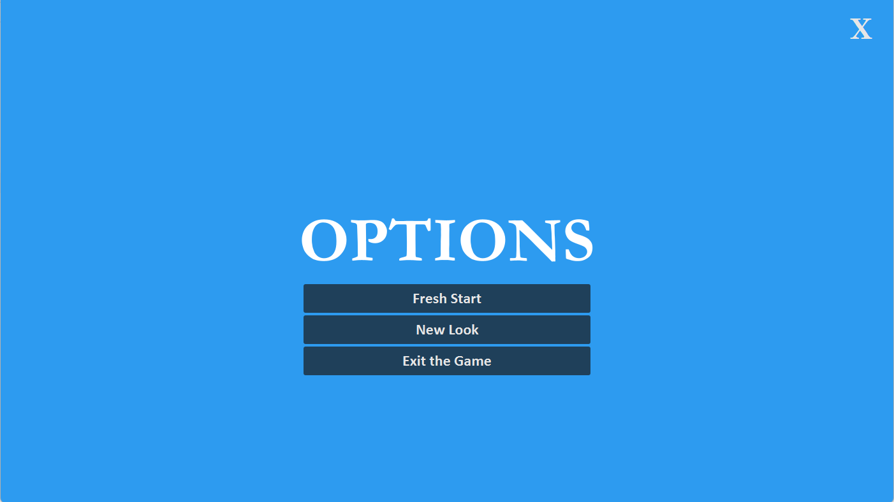
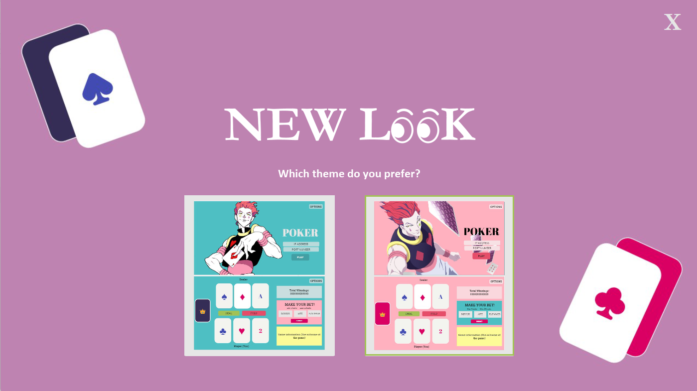

# 🃏♦️♠️ Poker (Hunter X Hunter Version) ♣️♥️👑

## Overview
In this project, we have implemented a networked version of the popular casino game 3 Card Poker using Java programming. The game utilizes event-driven programming and networking with Java Sockets. We designed the user interface (UI) using JavaFX. Our implementation not only allows up to four players to simultaneously log on to the [server](https://github.com/fhuan10/Poker-Game-Server) and participate in the game but also provides a visually appealing and interactive UI for an enhanced gaming experience.

## Authors
[Flora Huang](https://github.com/fhuan10) & [Nandini Jirobe](https://github.com/nandinijirobe)

## Project Images
Here are some visuals showcasing our project.

  
  

  
  

  
  

  
  

